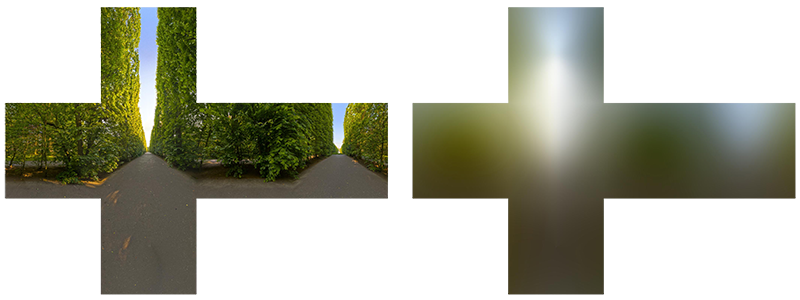

# 漫反射辐照度(Diffuse Irradiance)

IBL(image based lighting)是一种光源收集技术，不像之前的教程那样，光源是直接的可分析的，而IBL是将整个周围环境视为一个大光源。IBL的实现方式通常是从真实环境或3D场景中生成一张立方体贴图(cubemap)，然后我们在反射方程中将每个立方体贴图的像素视作一个光源。使用这种方式，我们可以有效地捕捉环境的全局光照，让物体更好地与环境融合。

由于IBL算法可以捕捉环境光照，所以它被认为是环境光(ambient lighting)的一种更加精确的输入方式，甚至可以简单地把它看作全局光照(global ilumination)。当我们把环境光照考虑进PBR中时，物体看起来会更加地物理，因此IBL对PBR非常重要。

在开始介绍IBL之前，我们先回顾下反射方程：

$$L_o(p,\omega_o) = \int\limits_{\Omega} (k_d\frac{c}{\pi} + k_s\frac{DFG}{4(\omega_o \cdot n)(\omega_i \cdot n)})L_i(p,\omega_i) n \cdot \omega_i d\omega_i$$

正如前面所描述的，我们的主要目标是对半球域$\Phi$内所有入射方向$\omega_i$的光辐射作积分。我们之前使用的光线方向都是确切的几个方向，所以积分非常容易，而这一次，我们需要考虑周围环境内每一个入射方向$\omega_i$的光辐射，于是积分变得不再那么简单。为了求解这个积分，我们需要达到两个要求：

- 我们需要一些方法去获取场景内各个方向$\omega_i$的光辐射。
- 求解积分需要快速、实时。

现在第一个要求相对简单。其实开篇我们就提到过，将环境或场景内的光辐射存到立方体贴图中。有了这张立方体贴图，我们可以将立方体贴图内的每一个像素视作一个光源。通过对这张贴图各个方向$\omega_i$采样，我们可以获取场景内该方向的光辐射。

获取指定场景内指定方向$\omega_i$的光辐射，如下：

```glsl
vec3 radiance = texture(_cubemapEnvironment, w_i).rgb;  
```

到目前为止，为了积分，我们需要在环境贴图中采样半球域$\Omega$内各个方向的光辐射，这样会造成片段着色器的计算量太大。为了让积分变得更高效，我们想对大部分的计算做一个预处理或者预计算。所以我们要对反射方程进行深入探究：

$$L_o(p,\omega_o) = \int\limits_{\Omega} (k_d\frac{c}{\pi} + k_s\frac{DFG}{4(\omega_o \cdot n)(\omega_i \cdot n)})L_i(p,\omega_i) n \cdot \omega_i d\omega_i$$

仔细观察反射方程，我们可以发现BRDF的漫反射$kd$项和镜面反射$ks$项是相互独立的，我们可以一分为二：

$$L_o(p,\omega_o) = \int\limits_{\Omega} (k_d\frac{c}{\pi}) L_i(p,\omega_i) n \cdot \omega_i  d\omega_i + \int\limits_{\Omega} (k_s\frac{DFG}{4(\omega_o \cdot n)(\omega_i \cdot n)})L_i(p\omega_i) n \cdot \omega_i  d\omega_i$$

通过将积分拆成两部分，我们可以对积分的漫反射部分和镜面反射部分单独处理。而我们这篇教程的重点是漫反射部分的积分。

进一步观察，我们发现漫反射的兰伯特(lambert)项是一个常数项(颜色c，折射系数$kd$和$\pi$在积分中都是常数)，而且对积分的变量没有任何的依赖，所以，我们可以将这个常数项提取出来：

$$L_o(p,\omega_o) = k_d\frac{c}{\pi} \int\limits_{\Omega} L_i(p,\omega_i) n \cdot \omega_i d\omega_i$$

现在这个积分仅仅依赖于$\omega_i$(假设$p$位于环境贴图的中心)。有了以上知识，我们可以计算或预计算得到一个新的立方体贴图，它记录了了各个采样方向$\omega_o$卷积得到的漫反射部分的积分值。

为了得到环境贴图，我们需要在每个方向为$\omega_o$的半球域$\Omega$内对各个入射方向$\omega_i$的光辐射进行离散采样并积分，最后取平均。


这个预计算得到的立方体贴图，储存了各个采样方向$\omega_o$的积分值，而这个积分值就是场景中某个表面方向为$\omega_o$的半球域内所有间接漫反射光辐射的总和(即辐照度)。这样一张立方体贴图被我们称作辐照度贴图(irradiance map)，利用它我们可以有效地对场景中任意方向$\omega_o$的辐照度进行采样。

> 辐射方程也依赖于位置$p$，我们假设它位于辐照度贴图的中心。这就意味着所有的间接的漫反射光必须来自单一的环境贴图，但是这样可能会和我们真实的感觉不符，尤其是室内。渲染引擎通过在场景中放置反射探头来解决这个问题，每个反射探头都会计算自己周围的辐照度贴图。这样，位置$p$处的辐照度就是其最近的反射探头之间插值得到的辐照度。不过现在，我们假设总是从环境贴图的中心采样，反射探头我们会在以后的教程中讨论。

下面是一张环境立方体贴图以及其生成的辐照度贴图(由[wave engine](http://www.indiedb.com/features/using-image-based-lighting-ibl)提供)，辐照度贴图对每个方向$\omega_o$的环境辐射取了平均值。



辐照度贴图的每个像素上存储了卷积结果(在方向$\omega_o$上)，它看起来像是对环境中的颜色和光照取了平均值。在这张环境贴图的任意方向采样，我们就能得到该场景中特定方向的辐照度。

## PBR和HDR

