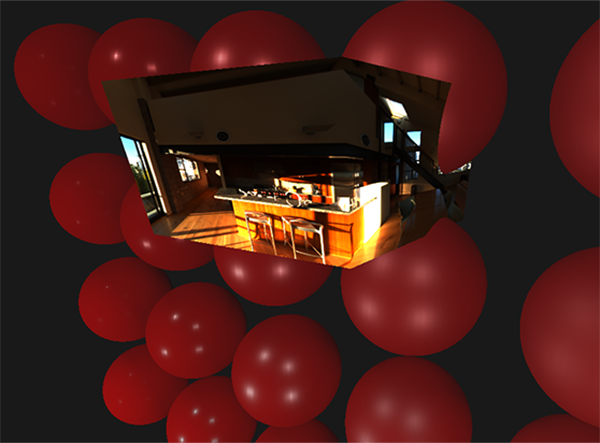

# 漫反射辐照度(Diffuse Irradiance)

原文 | [Diffuse Irradiance](https://learnopengl.com/PBR/IBL/Diffuse-irradiance)

IBL(image based lighting)是一种光源收集技术，不像之前的教程那样，光源是直接的可分析的，而IBL是将周围整个环境视为一个大光源。IBL的实现方式通常是从真实环境或3D场景中生成一张立方体贴图(cubemap)，然后我们在反射方程中将每个立方体贴图的像素视作一个光源。使用这种方式，我们可以有效地捕捉环境的全局光照，让物体更好地与环境融合。

由于IBL算法可以捕捉环境光照，所以它被认为是环境光(ambient lighting)的一种更加精确的输入方式，甚至可以简单地把它看作全局光照(global ilumination)。当我们把环境光照考虑进PBR中时，物体看起来会更加地物理，因此IBL对PBR非常重要。在开始介绍IBL之前，我们先回顾下反射方程：

$$L_o(p,\omega_o) = \int\limits_{\Omega} (k_d\frac{c}{\pi} + k_s\frac{DFG}{4(\omega_o \cdot n)(\omega_i \cdot n)})L_i(p,\omega_i) n \cdot \omega_i d\omega_i$$

正如前面所描述的，我们的主要目标是对半球域$\Omega$内所有入射方向$\omega_i$的光辐射作积分。我们之前使用的光线方向都是确切的几个方向，所以积分非常容易，而这一次，我们需要考虑周围环境内每一个入射方向$\omega_i$的光辐射，于是积分变得不再那么简单。为了求解这个积分，我们需要达到两个要求：

- 我们需要一些方法去获取场景内各个方向$\omega_i$的光辐射。
- 求解积分需要快速、实时。

现在第一个要求相对简单。其实开篇我们就提到过，将环境或场景内的光辐射存到立方体贴图中。有了这张立方体贴图，我们可以将立方体贴图内的每一个像素视作一个光源。通过对这张贴图各个方向$\omega_i$采样，我们可以获取场景内该方向的光辐射。

获取指定场景内指定方向$\omega_i$的光辐射，如下：

```glsl
vec3 radiance = texture(_cubemapEnvironment, w_i).rgb;  
```

到目前为止，为了积分，我们需要在环境贴图中采样半球域$\Omega$内各个方向的光辐射，这样会造成片段着色器的计算量太大。为了让积分变得更高效，我们想对大部分的计算做一个预处理或者预计算。所以我们要对反射方程进行深入探究：

$$L_o(p,\omega_o) = \int\limits_{\Omega} (k_d\frac{c}{\pi} + k_s\frac{DFG}{4(\omega_o \cdot n)(\omega_i \cdot n)})L_i(p,\omega_i) n \cdot \omega_i d\omega_i$$

仔细观察反射方程，我们可以发现BRDF的漫反射$kd$项和镜面反射$ks$项是相互独立的，我们可以一分为二：

$$L_o(p,\omega_o) = \int\limits_{\Omega} (k_d\frac{c}{\pi}) L_i(p,\omega_i) n \cdot \omega_i  d\omega_i + \int\limits_{\Omega} (k_s\frac{DFG}{4(\omega_o \cdot n)(\omega_i \cdot n)})L_i(p\omega_i) n \cdot \omega_i  d\omega_i$$

通过将积分拆成两部分，我们可以对积分的漫反射部分和镜面反射部分单独处理。而我们这篇教程的重点是漫反射部分的积分。

进一步观察，我们发现漫反射的兰伯特(lambert)项是一个常数项(颜色c，折射系数$kd$和$\pi$在积分中都是常数)，而且对积分的变量没有任何的依赖，所以，我们可以将这个常数项提取出来：

$$L_o(p,\omega_o) = k_d\frac{c}{\pi} \int\limits_{\Omega} L_i(p,\omega_i) n \cdot \omega_i d\omega_i$$

现在这个积分仅仅依赖于$\omega_i$(假设$p$位于环境贴图的中心)。有了以上知识，我们可以计算或预计算得到一个新的立方体贴图，它记录了了各个采样方向$\omega_o$卷积得到的漫反射部分的积分值。

为了得到环境贴图，我们需要在每个方向为$\omega_o$的半球域$\Omega$内对各个入射方向$\omega_i$的光辐射进行离散采样并积分，最后取平均。


这个预计算得到的立方体贴图，储存了各个采样方向$\omega_o$的积分值，而这个积分值就是场景中某个表面方向为$\omega_o$的半球域内所有间接漫反射光辐射的总和(即辐照度)。这样一张立方体贴图被我们称作辐照度贴图(irradiance map)，利用它我们可以有效地对场景中任意方向$\omega_o$的辐照度进行采样。

> 辐射方程也依赖于位置$p$，我们假设它位于辐照度贴图的中心。这就意味着所有的间接的漫反射光必须来自单一的环境贴图，但是这样可能会和我们真实的感觉不符，尤其是室内。渲染引擎通过在场景中放置反射探头来解决这个问题，每个反射探头都会计算自己周围的辐照度贴图。这样，位置$p$处的辐照度就是其最近的反射探头之间插值得到的辐照度。不过现在，我们假设总是从环境贴图的中心采样，反射探头我们会在以后的教程中讨论。

下面是一张环境立方体贴图以及其生成的辐照度贴图(由[wave engine](http://www.indiedb.com/features/using-image-based-lighting-ibl)提供)，辐照度贴图对每个方向$\omega_o$的环境辐射取了平均值。


辐照度贴图的每个像素上存储了卷积结果(在方向$\omega_o$上)，它看起来像是对环境中的颜色和光照取了平均值。在这张环境贴图中对任意方向采样，我们就能得到该场景中特定方向的辐照度。

## PBR和HDR

我们在[光照](https://learnopengl.com/#!PBR/Lighting)教程里了解过HDR：高动态范围的环境光照对PBR渲染管线来说是非常重要的。由于PBR的大部分输入都是基于真实的物理参数和测量值的，所以入射光参数值与其物理上的参数值相匹配是很有意义的。不管我们是对光通量做教学上的假设，还是直接使用他们的物理参数，一个简单的灯泡和太阳之间的差异是非常大的。如果不使用HDR，我们几乎是不可能正确地指定每种光的相对强度。

所以PBR和HDR是形影不离的，但是如何与IBL关联呢？在之前的教程中，我们可以看到在PBR中使用HDR是简单的。然而对于我们基于环境颜色和间接光生成的IBL， 我们需要一些方法将光的高动态范围存储到环境贴图中去。

到目前为止我们使用的环境立方体贴图(比如天空盒)，都是低动态范围的(LDR)。我们直接使用贴图上的颜色值(范围是0。0~1.0)并且按原样进行处理， 虽然这样在显示输出上没啥问题，但当我们要把它当做物理参数输入时就行不通了。

## Radiance HDR文件格式

Radiance HDR或RGBE是一种为Radiance渲染系统发明的图像格式，扩展名为.hdr。RGBE文件存储了一个立方体贴图全部6个面的浮点数据，这些数据的动态范围是超过0.0~1.0的。这种文件格式使用了一种技巧去存储浮点数，它不是每个RBG通道32位，而是每个通道8位，并且共享一个8位的指数E(这种存储方式会带来精度上的损失，但是省内存)，所以它使用32位存储一个像素颜色。这种方式工作的非常好，但是需要一个转换程序去把每个颜色值转成其对应的浮点数。

网上有大量免费的Radiance HDR格式的环境贴图资源，比如[sIBL archive](http://www.hdrlabs.com/sibl/archive.html)，下面是一张来自该网站的样图：


这可能和你想象的不太一样，这张图看起来是扭曲的，并且没有展示我们之前看到的立方体贴图的6个面。这张环境贴图是从一个球体投射到一个平面上，这样我们可以更容易地将环境信息存储到一张全景图中。不过这也带来了一个小问题，因为大部分可视化信息都集中在水平视图方向，少数分布在顶部和底部。在大部分渲染当中，这是一个可接受的妥协，你会发现大部分有用的光都集中在水平视图方向。

## HDR和stb_image.h

直接加载一张radiance HDR图片需要一些[文件格式](http://radsite.lbl.gov/radiance/refer/Notes/picture_format.html)的知识，虽然这并不困难但还是麻烦。幸运的是，流行的头文件[stb_image.h](https://github.com/nothings/stb/blob/master/stb_image.h)
支持直接加载randiance HDR图片并以浮点数组的形式输出，这刚好符合我们的需求。把stb_image添加进你的项目中后，加载一张HDR图片如以下代码：

```c++
#include "stb_image.h"
[...]

stbi_set_flip_vertically_on_load(true);
int width, height, nrComponents;
float *data = stbi_loadf("newport_loft.hdr", &width, &height, &nrComponents, 0);
unsigned int hdrTexture;
if (data)
{
    glGenTextures(1, &hdrTexture);
    glBindTexture(GL_TEXTURE_2D, hdrTexture);
    glTexImage2D(GL_TEXTURE_2D, 0, GL_RGB16F, width, height, 0, GL_RGB, GL_FLOAT, data); 

    glTexParameteri(GL_TEXTURE_2D, GL_TEXTURE_WRAP_S, GL_CLAMP_TO_EDGE);
    glTexParameteri(GL_TEXTURE_2D, GL_TEXTURE_WRAP_T, GL_CLAMP_TO_EDGE);
    glTexParameteri(GL_TEXTURE_2D, GL_TEXTURE_MIN_FILTER, GL_LINEAR);
    glTexParameteri(GL_TEXTURE_2D, GL_TEXTURE_MAG_FILTER, GL_LINEAR);

    stbi_image_free(data);
}
else
{
    std::cout << "Failed to load HDR image." << std::endl;
}  
```
stb_image.h自动将HDR值映射到一张浮点数列表中：默认每个通道32位，每个颜色3个通道。这些正是我们把全景图存到一张2D浮点纹理中所选要的。

## 从全景图到立方体贴图

直接使用全景图看起来是可能的，但是相比采样立方体贴图会更耗性能。因为在本次教程中，我们先将全景图转到立方体贴图再做进一步处理。
注意在处理过程中，我们也展示了如何对全景图进行采样，你可以自由地选择你所喜欢的方案。

将一张全景图转成立方体贴图，我们需要先渲染一个单位立方体，再将全景图投射到立方体内侧的面，最后将立方体内侧面上的6张图片作为立方体贴图的面。

下面是渲染立方体的顶点着色器，并且把localPos传递给片段着色器，当作采样的向量：

```c++
#version 330 core
layout (location = 0) in vec3 aPos;

out vec3 localPos;

uniform mat4 projection;
uniform mat4 view;

void main()
{
    localPos = aPos;  
    gl_Position =  projection * view * vec4(localPos, 1.0);
}
```
我们使用片段着色器给立方体上色，就像把全景图整齐地折叠成一个立方体一样。为了达到这个目的，我们需要将立方体的localPos插值得到的值最为片段着色器的采样向量，然后结合一些三角函数的魔数，对全景图像进行采样，就像采样立方体贴图一样。我们直接将结果存到立方体的面上，下面是我们要做的全部代码：

```glsl
#version 330 core
out vec4 FragColor;
in vec3 localPos;

uniform sampler2D equirectangularMap;

const vec2 invAtan = vec2(0.1591, 0.3183);
vec2 SampleSphericalMap(vec3 v)
{
    vec2 uv = vec2(atan(v.z, v.x), asin(v.y));
    uv *= invAtan;
    uv += 0.5;
    return uv;
}

void main()
{		
    vec2 uv = SampleSphericalMap(normalize(localPos)); // make sure to normalize localPos
    vec3 color = texture(equirectangularMap, uv).rgb;
    
    FragColor = vec4(color, 1.0);
}
```
给定一张HDR的全景图，如果将立方体渲染在场景中心，那么你看到的应该像下面这样：



上面展示了全景图映射到一个立方体上，但是到目前为止，我们还没有将HDR图像渲染到一张立方体贴图上。为了做到这一点，我们需要使用framebuffer来存储结果，并且渲染同一个立方体6次，每次渲染一个面：

```c++
unsigned int captureFBO, captureRBO;
glGenFramebuffers(1, &captureFBO);
glGenRenderbuffers(1, &captureRBO);

glBindFramebuffer(GL_FRAMEBUFFER, captureFBO);
glBindRenderbuffer(GL_RENDERBUFFER, captureRBO);
glRenderbufferStorage(GL_RENDERBUFFER, GL_DEPTH_COMPONENT24, 512, 512);
glFramebufferRenderbuffer(GL_FRAMEBUFFER, GL_DEPTH_ATTACHMENT, GL_RENDERBUFFER, captureRBO);  
```
当然，我们需要生成一个立方体贴图，并且为6个面分配内存：

```c++
unsigned int envCubemap;
glGenTextures(1, &envCubemap);
glBindTexture(GL_TEXTURE_CUBE_MAP, envCubemap);
for (unsigned int i = 0; i < 6; ++i)
{
    // note that we store each face with 16 bit floating point values
    glTexImage2D(GL_TEXTURE_CUBE_MAP_POSITIVE_X + i, 0, GL_RGB16F, 
                 512, 512, 0, GL_RGB, GL_FLOAT, nullptr);
}
glTexParameteri(GL_TEXTURE_CUBE_MAP, GL_TEXTURE_WRAP_S, GL_CLAMP_TO_EDGE);
glTexParameteri(GL_TEXTURE_CUBE_MAP, GL_TEXTURE_WRAP_T, GL_CLAMP_TO_EDGE);
glTexParameteri(GL_TEXTURE_CUBE_MAP, GL_TEXTURE_WRAP_R, GL_CLAMP_TO_EDGE);
glTexParameteri(GL_TEXTURE_CUBE_MAP, GL_TEXTURE_MIN_FILTER, GL_LINEAR);
glTexParameteri(GL_TEXTURE_CUBE_MAP, GL_TEXTURE_MAG_FILTER, GL_LINEAR);
```
接下来，就是获取全景图的2D纹理并渲染到立方体贴图的每个面上。

我不会讨论下面代码的细节，因为在之前的[帧缓冲(framebuffer)](https://learnopengl.com/#!Advanced-OpenGL/Framebuffers)和[点阴影(point shadows)](https://learnopengl.com/#!Advanced-Lighting/Shadows/Point-Shadows)的教程中都有详细的讨论，不过总结一下，就是设置6个不同的视图矩阵(view matrices)看向6个面，给定一个90度fov的透视矩阵(projection matrix)获取整个面，然后对一个立方体渲染6次，并把结果存储到一个浮点帧缓冲中。

```c++
glm::mat4 captureProjection = glm::perspective(glm::radians(90.0f), 1.0f, 0.1f, 10.0f);
glm::mat4 captureViews[] = 
{
   glm::lookAt(glm::vec3(0.0f, 0.0f, 0.0f), glm::vec3( 1.0f,  0.0f,  0.0f), glm::vec3(0.0f, -1.0f,  0.0f)),
   glm::lookAt(glm::vec3(0.0f, 0.0f, 0.0f), glm::vec3(-1.0f,  0.0f,  0.0f), glm::vec3(0.0f, -1.0f,  0.0f)),
   glm::lookAt(glm::vec3(0.0f, 0.0f, 0.0f), glm::vec3( 0.0f,  1.0f,  0.0f), glm::vec3(0.0f,  0.0f,  1.0f)),
   glm::lookAt(glm::vec3(0.0f, 0.0f, 0.0f), glm::vec3( 0.0f, -1.0f,  0.0f), glm::vec3(0.0f,  0.0f, -1.0f)),
   glm::lookAt(glm::vec3(0.0f, 0.0f, 0.0f), glm::vec3( 0.0f,  0.0f,  1.0f), glm::vec3(0.0f, -1.0f,  0.0f)),
   glm::lookAt(glm::vec3(0.0f, 0.0f, 0.0f), glm::vec3( 0.0f,  0.0f, -1.0f), glm::vec3(0.0f, -1.0f,  0.0f))
};

// convert HDR equirectangular environment map to cubemap equivalent
equirectangularToCubemapShader.use();
equirectangularToCubemapShader.setInt("equirectangularMap", 0);
equirectangularToCubemapShader.setMat4("projection", captureProjection);
glActiveTexture(GL_TEXTURE0);
glBindTexture(GL_TEXTURE_2D, hdrTexture);

glViewport(0, 0, 512, 512); // don't forget to configure the viewport to the capture dimensions.
glBindFramebuffer(GL_FRAMEBUFFER, captureFBO);
for (unsigned int i = 0; i < 6; ++i)
{
    equirectangularToCubemapShader.setMat4("view", captureViews[i]);
    glFramebufferTexture2D(GL_FRAMEBUFFER, GL_COLOR_ATTACHMENT0, 
                           GL_TEXTURE_CUBE_MAP_POSITIVE_X + i, envCubemap, 0);
    glClear(GL_COLOR_BUFFER_BIT | GL_DEPTH_BUFFER_BIT);

    renderCube(); // renders a 1x1 cube
}
glBindFramebuffer(GL_FRAMEBUFFER, 0);  
```
对于立方体贴图的每一个面，我们都会重新设置帧缓冲的颜色附件(color attachment)的纹理目标(texture target)，将立方体贴图的每个面直接渲染到场景当中去。一旦渲染完成(我们只需要渲染一次)，这张立方体贴图envCubemap就是我们想要的环境贴图。

让我们写一个简单的天空盒shader来测试下生成的立方体贴图：

```glsl
#version 330 core
layout (location = 0) in vec3 aPos;

uniform mat4 projection;
uniform mat4 view;

out vec3 localPos;

void main()
{
    localPos = aPos;

    mat4 rotView = mat4(mat3(view)); // remove translation from the view matrix
    vec4 clipPos = projection * rotView * vec4(localPos, 1.0);

    gl_Position = clipPos.xyww;
}
```
注意xyww的技巧，这么做是确保立方体片段着色器中的深度值永远是最大值1.0，可以参考[立方体贴图(cubemap)](https://learnopengl.com/#!Advanced-OpenGL/Cubemaps)教程。还有一点需要注意的是，我们要把深度比较函数修改成GL_LEQUAL：

```c++
glDepthFunc(GL_LEQUAL);  
```
然后片段着色器会直接使用立方体的local fragment position去采样：

```glsl
#version 330 core
out vec4 FragColor;

in vec3 localPos;
  
uniform samplerCube environmentMap;
  
void main()
{
    vec3 envColor = texture(environmentMap, localPos).rgb;
    
    envColor = envColor / (envColor + vec3(1.0));
    envColor = pow(envColor, vec3(1.0/2.2)); 
  
    FragColor = vec4(envColor, 1.0);
}
```
插值后的localPos其实就是正确的方向向量，我们直接拿来对环境立方体贴图进行采样就可以了。在顶点着色器中，相机的平移被忽略，所以这段shader渲染得到的是一个不会移动的背景。另外，上面的shader中我们直接将环境贴图的HDR值输出到默认是LDR的帧缓冲中， 而大部分HDR贴图是处于线性颜色空间的，为了得到正确的色调映射，在写入帧缓冲前，我们需要对输出进行[伽马校正(gamma correction)](https://learnopengl.com/#!Advanced-Lighting/Gamma-Correction)。

现在把采样得到的环境贴图和之前的小球一起渲染，看起来应该是这样的：


好吧，我们费了不少力气到这一步，不过我们还是成功地读取了一张HDR环境贴图，并将它从全景图映射到一张立方体贴图中，最后渲染成一个场景的天空盒子。另外，我们设计了一个渲染立方体贴图6个面的小系统，在对环境贴图进行卷积时，我们还会用到它。你可以在[这里](https://learnopengl.com/code_viewer_gh.php?code=src/6.pbr/2.1.1.ibl_irradiance_conversion/ibl_irradiance_conversion.cpp)找到完整的代码。

## 立方体贴图卷积

正如教程开头描述的那样，我们的主要目标是，对场景中以环境立方体贴图存储的辐照度进行积分。我们知道，获取场景中的辐射$L(p,\omega_i)$可以通过对HDR环境贴图按一定的方向$\omega_i$进行采样得到。所以为了得到积分值，我们必须在每个片段着色器中对半球域$\Omega$内所有可能的方向上的辐射采样。

然而，因为采样方向理论上是无穷的，所以在计算上我们不可能对半球域$\Omega$所有可能的方向上的辐射进行采样。不过，我们可以选取有限数量的方向来近似，通过在半球域内等间距或随机地采样，最终得到一个相当精确的辐照度的近似值，用离散的方式可以有效地解决积分问题。

但是，在片段着色器中实时地对进行大量的采样消耗是巨大的，所以我们需要进行预计算。方向为$\omega_o$的半球域$\Omega$决定了我们可以得到哪个方向的辐照度，所以我们可以预计算所有可能的半球域：

$$L_o(p,\omega_o) = k_d\frac{c}{\pi} \int\limits_{\Omega} L_i(p,\omega_i) n \cdot \omega_i  d\omega_i$$

给定任意方向向量$\omega_i$，我们可以对预计算得到的辐照度贴图采样的到该方向$\omega_i$上总的漫反射辐照度。确定一个微表面间接漫反射的辐照度，我们可以从其表面法线$N$为方向的半球域内获取总的辐照度。获取场景中的辐照度例子如下：

```glsl
vec3 irradiance = texture(irradianceMap, N);
```
现在，我们需要对环境光做卷积并转成一张立方体贴图，这张贴图就是辐照度贴图。对于给定的每个微表面，其半球域就是以其法向量$N$为方向的半球域，对立方体贴图做卷积等于对以法线$N$为方向的半球域$\Omega$内方向为$\omega_i$的辐射求和取平均。


值得庆幸的是，本教程中前面所有繁琐的配置代码都不是没有用处的，现在我们直接使用转换后的立方体贴图，因为将全景图转成立方体贴图的配置代码我们早就过了，所以我们可以拿来直接使用，但要使用不同的片段着色器：

```glsl
#version 330 core
out vec4 FragColor;
in vec3 localPos;

uniform samplerCube environmentMap;

const float PI = 3.14159265359;

void main()
{		
    // the sample direction equals the hemisphere's orientation 
    vec3 normal = normalize(localPos);
  
    vec3 irradiance = vec3(0.0);
  
    [...] // convolution code
  
    FragColor = vec4(irradiance, 1.0);
}
```
environmentMap是由全景HDR环境贴图转成的立方体贴图。

对环境贴图做卷积有很多种方法，而本文使用的方法是，对立方体贴图内的每一个像素，在以其法线为方向的半球域$\Omega$内，取一定数量的采样向量进行采样，最后对其结果取平均。这些采样向量是均匀分布在半球域内的。注意，用一定数量的采样向量进行离散采样求解连续函数的积分，其得到的结果是一个近似值。我们使用的采样向量越多，就越逼近积分。

由于原始的积分公式使用的是立体角$d\omega$，不方便做计算，此处我们将它转成球坐标系下的$\theta$和$\phi$。
有$d\omega=sin(\theta)d\phi d\theta$


>译注：此处推导原文有误，下面是修改过的结果

转为二重积分，方位角$\phi\in[0,2\pi]$，天顶角$\theta\in[0,1/2\pi]$，是一个半球：

$$L_o(p,\phi_o,\theta_o) = k_d\frac{c}{\pi} \int_{\phi = 0}^{2\pi} \int_{\theta = 0}^{\frac{1}{2}\pi} L_i(\phi_i, \theta_i) \cos(\theta) \sin(\theta)  d\phi d\theta$$

根据蒙特卡洛积分：

$$\int_0^\pi f(x)dx\approx\frac{\pi}{N}\sum_{i=1}^Nf(x_i)$$

可求得：

$$L_o(p,\phi_o,\theta_o) = \frac{c}{\pi}\frac{2\pi}{N_1}\frac{\pi}{2N_2}\sum^{N_1}\sum^{N_2}L_i(p,\theta_i,\phi_i)cos(\theta_i)sin(\theta_i)$$

$$L_o(p,\phi_o,\theta_o) = \frac{c\pi}{N_1N_2}\sum^{N_1}\sum^{N_2}L_i(p,\theta_i,\phi_i)cos(\theta_i)sin(\theta_i)$$

最终代码如下：

```glsl
vec3 irradiance = vec3(0.0);  
 
vec3 up    = vec3(0.0, 1.0, 0.0);
vec3 right = cross(up, normal);
up         = cross(normal, right);
 
float sampleDelta = 0.025;
float nrSamples = 0.0; 
for(float phi = 0.0; phi < 2.0 * PI; phi += sampleDelta)
{
    for(float theta = 0.0; theta < 0.5 * PI; theta += sampleDelta)
    {
        // spherical to cartesian (in tangent space)
        vec3 tangentSample = vec3(sin(theta) * cos(phi),  sin(theta) * sin(phi), cos(theta));
        // tangent space to world
        vec3 sampleVec = tangentSample.x * right + tangentSample.y * up + tangentSample.z * N; 
 
        irradiance += texture(environmentMap, sampleVec).rgb * cos(theta) * sin(theta);
        nrSamples++;
    }
}
irradiance = PI * irradiance * (1.0 / float(nrSamples));
```
我们指定一个固定的sampleDelta的步进值，来对半球域做遍历。增大或减小这步进值都相应会减小或增大采样的精度。

在两个循环内，我们将两个球坐标转成3D笛卡尔采样向量，再把向量从切线空间转到世界空间，再直接使用采样向量采样HDR环境贴图。我们将每个结果加到辐照度irradiance中，最后再将它除以总的采样次数nrSamples，得到辐照度的平均值。

现在剩下要做的就是设置OpenGL的渲染代码，这样我们可以对之前生成的envCubemap做卷积。
首先我们创建辐照度贴图(再次声明，我们仅在渲染循环的之前创建一次)：

```c++
unsigned int irradianceMap;
glGenTextures(1, &irradianceMap);
glBindTexture(GL_TEXTURE_CUBE_MAP, irradianceMap);
for (unsigned int i = 0; i < 6; ++i)
{
    glTexImage2D(GL_TEXTURE_CUBE_MAP_POSITIVE_X + i, 0, GL_RGB16F, 32, 32, 0, 
                 GL_RGB, GL_FLOAT, nullptr);
}
glTexParameteri(GL_TEXTURE_CUBE_MAP, GL_TEXTURE_WRAP_S, GL_CLAMP_TO_EDGE);
glTexParameteri(GL_TEXTURE_CUBE_MAP, GL_TEXTURE_WRAP_T, GL_CLAMP_TO_EDGE);
glTexParameteri(GL_TEXTURE_CUBE_MAP, GL_TEXTURE_WRAP_R, GL_CLAMP_TO_EDGE);
glTexParameteri(GL_TEXTURE_CUBE_MAP, GL_TEXTURE_MIN_FILTER, GL_LINEAR);
glTexParameteri(GL_TEXTURE_CUBE_MAP, GL_TEXTURE_MAG_FILTER, GL_LINEAR);
```
由于辐照度题图是对周围环境均匀采样并取平均，它没有很多高频的细节，因此我们可以将该图存储在低分率(32*32)下，并让OpenGL做线型滤波。接下来，我们将获得的帧缓冲重新缩放到新的分辨率：

```c++
glBindFramebuffer(GL_FRAMEBUFFER, captureFBO);
glBindRenderbuffer(GL_RENDERBUFFER, captureRBO);
glRenderbufferStorage(GL_RENDERBUFFER, GL_DEPTH_COMPONENT24, 32, 32);  
```
使用卷积shader，然后我们像获取环境立方体贴图一样对环境贴图做卷积：

```c++
irradianceShader.use();
irradianceShader.setInt("environmentMap", 0);
irradianceShader.setMat4("projection", captureProjection);
glActiveTexture(GL_TEXTURE0);
glBindTexture(GL_TEXTURE_CUBE_MAP, envCubemap);

glViewport(0, 0, 32, 32); // don't forget to configure the viewport to the capture dimensions.
glBindFramebuffer(GL_FRAMEBUFFER, captureFBO);
for (unsigned int i = 0; i < 6; ++i)
{
    irradianceShader.setMat4("view", captureViews[i]);
    glFramebufferTexture2D(GL_FRAMEBUFFER, GL_COLOR_ATTACHMENT0, 
                           GL_TEXTURE_CUBE_MAP_POSITIVE_X + i, irradianceMap, 0);
    glClear(GL_COLOR_BUFFER_BIT | GL_DEPTH_BUFFER_BIT);

    renderCube();
}
glBindFramebuffer(GL_FRAMEBUFFER, 0);  
```
这一步之后，我们应该有了一张预计算的辐照度贴图，我们可以直接把它用在漫反射的IBL中。为了查看我们是否成功地对环境图进行了卷积，让我们将天空盒的环境贴图替换成辐照度贴图：


如果它看起来像是高度模糊的环境贴图，证明您已经成功对环境贴图做了积分。

## PBR和间接辐照度光照

辐照度贴图代表了反射方程的漫反射部分，通过对周围的间接光辐射累加得到。由于光线不是来自任何直接光源，而是来自周围环境，于是我们把漫反射光和镜面反射光当做当前的环境光，替换之前设置的常数。

首先，确保添加了预计算的辐照度贴图：

```glsl
uniform samplerCube irradianceMap;
```
给定包含场景内所有间接漫反射光的辐照度贴图，再给定表面法向量的情况下，提取微表面的辐照度就和采样一张纹理一样简单：

```glsl
// vec3 ambient = vec3(0.03);
vec3 ambient = texture(irradianceMap, N).rgb;
```
然而，我们在拆分的反射方程中可以看到，间接光包含了漫反射和镜面反射两部分，我们需要相应地对漫反射部分加权重。与前一个教程中做的类似，我们使用菲涅尔(Fresnel)方程确定表面间接的反射率，并由此得到反射率和漫反射率：

```glsl
vec3 kS = fresnelSchlick(max(dot(N, V), 0.0), F0);
vec3 kD = 1.0 - kS;
vec3 irradiance = texture(irradianceMap, N).rgb;
vec3 diffuse    = irradiance * albedo;
vec3 ambient    = (kD * diffuse) * ao; 
```

由于环境光来自以法向量$N$为方向的半球域内的各个方向，所以我们找不到一个单一的半角(halfway)向量来确定菲涅尔反射。为了近似菲涅尔反射，我们使用法向量和视图向量之间的夹角来计算菲涅尔。然而之前我们使用的微表面半角向量，表面粗糙度作为菲涅尔函数的输入参数，并且结果是受粗糙度影响的。而我们当前没有考虑任何的粗糙度，所以表面的反射率最终会相对偏高。间接光和直接光具有相同的性质，所以我们预期粗糙的表面的边缘反射强度会越小。因为我们没有考虑粗糙度，所以菲涅尔反射看起来并不太好(为了演示的目的，稍微夸张了一点)：


我们可以缓解这个问题通过向菲涅尔方程传入粗糙度，就像[Sébastien Lagarde]描述的那样：

```glsl
vec3 fresnelSchlickRoughness(float cosTheta, vec3 F0, float roughness)
{
    return F0 + (max(vec3(1.0 - roughness), F0) - F0) * pow(1.0 - cosTheta, 5.0);
}  
```
菲涅尔反射考虑粗糙度，ambient代码最终看起来是这样的：

```glsl
vec3 kS = fresnelSchlickRoughness(max(dot(N, V), 0.0), F0, roughness); 
vec3 kD = 1.0 - kS;
vec3 irradiance = texture(irradianceMap, N).rgb;
vec3 diffuse    = irradiance * albedo;
vec3 ambient    = (kD * diffuse) * ao; 
```
可以看到，实际的IBL计算非常简单，只需要对一张立方体贴图进行查找就好了，而大部分工作则是预计算和将环境贴图卷积成辐照度贴图。

我们将[光照(lighting)](https://learnopengl.com/#!PBR/Lighting)教程中的场景作为初始场景，其中每个球体都有一个垂直增加的金属度和水平增加的粗糙值，并添加IBL的漫反射光，它看起来是这样的:


它还是看起来有点怪，因为金属球需要某种形式的反射才能开始看起来像金属表面(因为金属表面几乎不反射漫反射光)，而目前我们这些球表面只反射了一些点光源。尽管如此，这些球已经可以和环境形成互动(特别是你切换环境贴图时)了，球的表面会对环境光做出相应的变化。

你可以在[这里](https://learnopengl.com/code_viewer_gh.php?code=src/6.pbr/2.1.2.ibl_irradiance/ibl_irradiance.cpp)找到本次主题的完整的源码。在下一篇教程中，我们将添加反射方程的高光部分，你将见识到PBR真正的威力。

## 延伸阅读

- [Coding Labs: Physically based rendering](http://www.codinglabs.net/article_physically_based_rendering.aspx): an introduction to PBR and how and why to generate an irradiance map.

- [The Mathematics of Shading](http://www.scratchapixel.com/lessons/mathematics-physics-for-computer-graphics/mathematics-of-shading): a brief introduction by ScratchAPixel on several of the mathematics described in this tutorial, specifically on polar coordinates and integrals.

