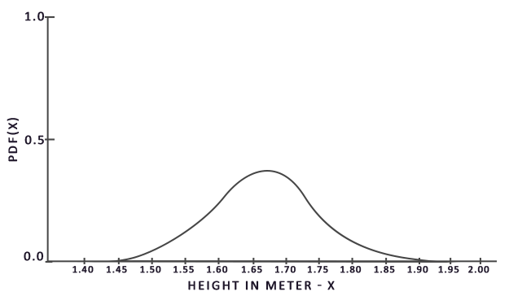
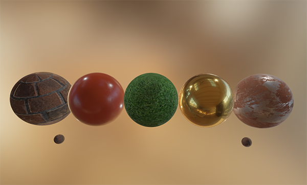

# Specular-IBL

在上一篇教程中，我们将预计算的辐照度贴图和IBL的漫反射(Diffuse)部分结合了起来。在本教程中，我们将关注反射方程的镜面(Specular)部分:

$$L_o(p,\omega_o) = \int\limits_{\Omega} (k_d\frac{c}{\pi} + k_s\frac{DFG}{4(\omega_o \cdot n)(\omega_i \cdot n)})L_i(p,\omega_i) n \cdot \omega_i  d\omega_i$$

你会注意到Cook-Torrance镜面部分(乘以$kS$)在积分上不是常数，它依赖于入射光的方向，也依赖于入射的视线方向。试图对所有入射光方向和所有可能的视线方向一起积分，计算量太大，是无法实时完成的。Epic Games提出了一种解决方案，作了一些妥协，使对镜面部分做实时卷积成为可能，这就是有名的split sum approximation。

split sum approximation将反射方程的镜面反射部分分割成两个独立的部分，我们可以分别对其进行卷积，然后在PBR着色器中重新组合起来，最终实现IBL渲染。与我们对辐照度图进行预卷积的方法类似，split sum approximation做卷积时需要一张HDR环境贴图作为输入。为了理解split sum approximation，再次看下反射方程，但这次我们只关注镜面部分(我们在之前的教程中提取了漫反射部分):

$$L_o(p,\omega_o) = \int\limits_{\Omega} (k_s\frac{DFG}{4(\omega_o \cdot n)(\omega_i \cdot n)}L_i(p,\omega_i) n \cdot \omega_i  d\omega_i=\int\limits_{\Omega} f_r(p, \omega_i, \omega_o) L_i(p,\omega_i) n \cdot \omega_i  d\omega_i$$

由于与辐照度卷积相同的(性能上)原因，对镜面部分实时积分并有不错的性能是不大可能的。所以我们最好对这个积分预计算，并得到一张镜面IBL贴图，然后用的微表面的法向量$N$采样这张贴图，最后得到积分值。但是现在有点棘手，我们能够预计算辐照度图是因为积分只跟$\omega_i$有关，然后我们可以将漫反射常量项提取到积分外面。然而这次,积分不仅仅取决于$\omega_i$,而且明显和BRDF有关:

$$f_r(p, w_i, w_o) = \frac{DFG}{4(\omega_o \cdot n)(\omega_i \cdot n)}$$

这一次，积分也依赖于$w_o$，我们没法使用两个方向向量对一个预计算得到的立方体贴图进行采样。这里的位置$p$与前面的教程中描述的不相关。对$\omega_i和\omega_o$的每种可能组合的积分做预计算，在实时渲染中也是没法实现的。

Epic Games的split sum approximation解决了这一问题，它将方程拆分为两个独立的部分分别做预计算，再将两部分结果重新组合得到预计算的值。split sum approximation将镜面部分的积分分成两个独立的积分:

$$L_o(p,\omega_o) = \int\limits_{\Omega} L_i(p,\omega_i) d\omega_i*\int\limits_{\Omega} f_r(p, \omega_i, \omega_o) n \cdot \omega_i d\omega_i$$

第一部分(卷积时)称为pre-filtered环境贴图，它是(类似于辐照度图)预卷积得到的环境贴图，但这次考虑了粗糙度。为了生成递增的多级粗糙度贴图，环境贴图被多种分散的向量采样并卷积，从而产生多种模糊的效果。对于不同级别的粗糙度，我们将按顺序将模糊的结果存储在pre-filtered贴图的多级mipmap中。例如，一张pre-filtered环境贴图，它存储了5张不同粗糙度的mipmap的预卷积结果如下:


我们使用Cook-Torrance BRDF的法线分布函数(NDF)生成采样向量及其散射强度，该函数同时将法向量和视线向量作为输入。在对环境贴图做卷积前，我们并不知道视线方向，Epic Game做了进一步的近似，假设视线方向(就是镜面反射的方向)总是等于采样方向$\omega_o$。就可以转换成以下代码:

```glsl
vec3 N = normalize(w_o);
vec3 R = N;
vec3 V = R;
```
这样，对pre-filtered贴图做卷积时就不需要知道视线方向了。这意味着当我们从如下图所示的角度观察镜面反射时，我们不能得到一个较好的以掠射角为观察角度的镜面反射(感谢the Moving Frostbite to PBR article)，不过这通常被认为是一种合适的妥协:


方程的第二部分等于镜面积分的BRDF部分。如果假设各个方向的入射光都是是白色的即$L(p, x) = 1.0$那么我们可以通过输入粗糙度和法向量与入射光方向$\omega_i$之间的夹角(或$n\cdot\omega_i$)来预计算BRDF。Epic Games在LUT纹理中存储了对不同粗糙度值的法线方向和入射光方向的BRDF预计算的结果，该纹理被称为BRDF integration map。在我们镜面反射积分的第二部分中，LUT纹理输出一个比例值(红色)和一个偏移值(绿色)到其表面的菲涅耳反射：


我们生成LUT纹理，其平面横向坐标(介于0.0和1.0之间)作为BRDF参数输入，$n\cdot\omega_i$及其垂直方向的纹理坐标作为粗糙度参数输入。使用这张BRDF integration map和pre-filtered的环境贴图，我们可以结合两者得到镜面反射积分的结果:

```glsl
float lod             = getMipLevelFromRoughness(roughness);
vec3 prefilteredColor = textureCubeLod(PrefilteredEnvMap, refVec, lod);
vec2 envBRDF          = texture2D(BRDFIntegrationMap, vec2(NdotV, roughness)).xy;
vec3 indirectSpecular = prefilteredColor * (F * envBRDF.x + envBRDF.y) 
```

以上，应该能让你对Epic Games的split sum approximation近似求解反射方程的间接镜面反射部分，有了一个大致的了解。现在让我们尝试自己构建预卷积部分。

## Pre-filtering一张HDR环境贴图

对环境贴图进行pre-filtering与对辐照度贴图进行卷积非常相似。不同之处在于，我们现在考虑了粗糙度，并按顺序将反射结果存在多级pre-filtered mipmap中。

首先，我们需要生成一个新的立方体贴图来保存pre-filtered环境贴图的数据。为了确保为其多级mipmap分配足够的内存，我们可以简单地调用glGenerateMipmap来分配内存。

```c++
unsigned int prefilterMap;
glGenTextures(1, &prefilterMap);
glBindTexture(GL_TEXTURE_CUBE_MAP, prefilterMap);
for (unsigned int i = 0; i < 6; ++i)
{
    glTexImage2D(GL_TEXTURE_CUBE_MAP_POSITIVE_X + i, 0, GL_RGB16F, 128, 128, 0, GL_RGB, GL_FLOAT, nullptr);
}
glTexParameteri(GL_TEXTURE_CUBE_MAP, GL_TEXTURE_WRAP_S, GL_CLAMP_TO_EDGE);
glTexParameteri(GL_TEXTURE_CUBE_MAP, GL_TEXTURE_WRAP_T, GL_CLAMP_TO_EDGE);
glTexParameteri(GL_TEXTURE_CUBE_MAP, GL_TEXTURE_WRAP_R, GL_CLAMP_TO_EDGE);
glTexParameteri(GL_TEXTURE_CUBE_MAP, GL_TEXTURE_MIN_FILTER, GL_LINEAR_MIPMAP_LINEAR); 
glTexParameteri(GL_TEXTURE_CUBE_MAP, GL_TEXTURE_MAG_FILTER, GL_LINEAR);

glGenerateMipmap(GL_TEXTURE_CUBE_MAP);
```
注意，由于我们要对prefilterMap的mipmaps进行采样，因此需要确保将其GL_TEXTURE_MIN_FILTER设置为GL_LINEAR_MIPMAP_LINEAR，以启用三线滤波。我们将pre-filtered的镜面反射以每面128*128的分辨率存储在其基础级别的mipmap上。这对于大多数反射来说已经足够了，但是如果你有大量光滑的材质(比如汽车反射)，你可能需要提高分辨率。

在前面的教程中，我们在球坐标系下使用均匀分布在半球域$\Omega$内的采样向量来对环境贴图做卷积。虽然这计算辐照度还可以，但是对计算镜面反射来说效率就低了。对于镜面反射，根据表面的粗糙程度，反射光分布在反射矢量$r$和法线$n$之间，但更靠近$r$，除非表面非常粗糙，反射光完全分布在$r$周围:


出射光形成的形状称为镜面波瓣。随着粗糙度的增加，反射波瓣的尺寸增大。随着入射光方向的改变，镜面波瓣的形状也会变化。因此，镜面波瓣的形状高度依赖于材料。

在微表面模型中，在给定入射光方向的后，我们可以想到镜面波瓣是朝向半角方向的。由于大多数光最终都在一个镜面波瓣中，所以以这种方式生成采样向量是有意义的，否则大多数都会被浪费掉。这个过程被称为重要性抽样。

## 蒙特卡洛积分和重要性采样

为了充分理解重要性采样，我们先深入研究蒙特卡洛积分的数学原理。蒙特卡洛积分主要是统计和概率论的结合。蒙特卡洛帮助我们在不考虑所有总体的情况下，离散地解出一个总体的某个统计量或值。

例如，假设你想统计一个国家所有公民的平均身高。你可以测量去每个公民的平均身高，虽然这样你能得到一个准确的答案，但是一个国家的人口众多，它将消耗你大量的时间和精力，所以这个方案是不现实的。

另一个方法是选择一个小的多的完全随机的(无偏倚的)子集，测量他们的身高和平均值。这个子集人口的数量可能只有100人，虽然不能的到一个完全精确的结果，但是你能得到一个近似结果。这就是众所周知的大数定律。大数定律通俗一点来讲，就是样本数量$N$很大的时候，样本均值和真实均值充分接近。

蒙特卡洛积分建立在大数定律的基础上，在求解积分时采用了类似的方法。不是对所有可能的(理论上无限)样本值$x$求积分，而是从总体中随机抽取N个样本值对其求平均。随着$N$的增加，我们肯定能得到:

$$O = \int\limits_{a}^{b} f(x) dx = \frac{1}{N} \sum_{i=0}^{N-1} \frac{f(x)}{pdf(x)}$$

为了求解积分域为$a$到$b$的积分，我们取N个随机样本值，把它们加起来除以样本总数得到平均值。pdf表示概率密度函数，它告诉我们特定样本在整个样本集合中发生的概率。例如，身高的pdf看起来有点像这样:



从这张图中，我们可以看到，如果随机抽取总体样本，选到身高1.70的概率更高，而身高1.50概率则比较低。

在蒙特卡洛积分当中，一些样本的概率可能比其他样本。这就是为什么对于一般蒙特卡洛估算，我们会根据pdf除以或乘以采样值的样本概率。到目前为止，在每一个估算积分的例子中，我们得到的样本是均匀分布的，并且其概率也是一致的，所以我们的估算是无偏的，这意味着随着样本数量的不断增加，我们最终会收敛到积分的精确解。

然而，一些蒙特卡洛估算是有偏的，这意味着生成的样本不是完全随机的，而是集中在一个特定的值或方向。这些有偏蒙特卡洛估算具有更快的收敛速度，这意味着它们可以以更快的速度收敛到精确解，但由于它们有偏的性质，它们很可能永远不会收敛到精确解。这通常是一个可以接受的妥协，特别是在计算机图形学中，因为只要结果在视觉上可以接受，精确的解决方案就不是太重要。我们很快就会看到重要采样(使用有偏估算)生成的样本偏向于特定的方向，在这种情况下，我们将每个样本乘以或除以其对应的pdf。

蒙特卡洛集成在计算机图形学中非常常见，因为它是一在种相当直观的方式，使用离散高效的方式近似连续积分：在任意的面积或体积(如半球域$\Omega$)中，取$N$个随机样品，最后根据他们的各自的权重生成结果。

蒙特卡洛积分是一个宽泛的数学主题，我不会深入研究细节，但我们会提到多种生成随机样本的方法。默认情况下，之前我们使用的样本基本都是完全(伪)随机的，不过利用半随机序列的一些特性，我们仍然可以生成随机的样本向量，而且这些样本具有有趣的特性。例如，我们可以使用低差序列进行蒙特卡洛积分，它仍然生成随机样本，但是样本的分布更加均匀:


利用低差序列生成蒙特卡洛样本向量的过程称为准蒙特卡洛积分。准蒙特卡洛方法具有更快的收敛速度，对于性能优化具有很大的意义。

在了解了蒙特卡洛和拟蒙特卡洛积分之后，我们可以利用一个有趣的性质来获得更快的收敛速度，即重要性抽样。在上一篇教程，我提到过在发生镜面反射时，反射光被限制在一个由表面粗糙度决定其大小的镜面波瓣中。由于任何在镜面波瓣外生成的(拟)随机样本与镜面积分无关，因此将生成的样本集中在镜面波瓣中是有意义的，代价是这样的蒙特卡洛估算是有偏置。

重要性采样的本质是：在某个区域生成采样向量，该区域受其表面粗糙度的约束，并且其朝向是微表面的半角向量。准蒙特卡洛使用低差序列进行采样，利用重要性采样对样本向量进行偏置，可以得到了较高的收敛速度。因为达到解的速度更快，所以仅需更少的样本我们就可以达到足够的近似。正因为如此，这种方式甚至允许图像进行实时求解镜面积分，尽管它仍然比预计算结果慢得多。

## 低差序列

在本教程中，给定一组随机的低差序列，我们将使用基于准蒙特卡洛的重要性采样，来预计算反射方程的间接镜面反射部分。我们将使用的序列叫做Hammersley序列，[Holger Dammertz](http://holger.dammertz.org/stuff/notes_HammersleyOnHemisphere.html)对此进行过详细描述。Hammersley序列基于Van Der Corpus序列，它将二进制表达式镜像到小数点右边，而这个二进制数的值就是最终的结果。

使用一些简单的技巧，就可以在shader中非常有效地生成Van Der Corpus序列，我们将使用它来获得一个Hammersley序列，其中$i$是变量，$N$是样本集的大小:

```glsl
float RadicalInverse_VdC(uint bits) 
{
    bits = (bits << 16u) | (bits >> 16u);
    bits = ((bits & 0x55555555u) << 1u) | ((bits & 0xAAAAAAAAu) >> 1u);
    bits = ((bits & 0x33333333u) << 2u) | ((bits & 0xCCCCCCCCu) >> 2u);
    bits = ((bits & 0x0F0F0F0Fu) << 4u) | ((bits & 0xF0F0F0F0u) >> 4u);
    bits = ((bits & 0x00FF00FFu) << 8u) | ((bits & 0xFF00FF00u) >> 8u);
    return float(bits) * 2.3283064365386963e-10; // / 0x100000000
}
// ----------------------------------------------------------------------------
vec2 Hammersley(uint i, uint N)
{
    return vec2(float(i)/float(N), RadicalInverse_VdC(i));
}  
```
GLSL Hammersley函数给出了总样本集大小为N的低偏差值样本i。

!!! Important

    **没有位操作符支持的哈默斯利序列**

    并非所有OpenGL相关驱动程序都支持位操作符(例如WebGL和OpenGL ES 2.0)，在这种情况下，您可能希望使用不依赖于位操作符的Van Der Corpus序列的替代版本:

    ```glsl
    float VanDerCorpus(uint n, uint base)
    {
        float invBase = 1.0 / float(base);
        float denom   = 1.0;
        float result  = 0.0;

        for(uint i = 0u; i < 32u; ++i)
        {
            if(n > 0u)
            {
                denom   = mod(float(n), 2.0);
                result += denom * invBase;
                invBase = invBase / 2.0;
                n       = uint(float(n) / 2.0);
            }
        }

        return result;
    }
    // ----------------------------------------------------------------------------
    vec2 HammersleyNoBitOps(uint i, uint N)
    {
        return vec2(float(i)/float(N), VanDerCorpus(i, 2u));
    }
    ```
    注意，在旧硬件中的GLSL循环上限次数可能只有32位。虽然这个版本的性能较差，但是它可以在所有硬件上工作，如果你发现的你的程序中不支持位操作，可以选择这个方法。

## GGX重要性采样

 不同于之前在半球域$\Omega$内使用均匀随机的样本向量进行积分，这次我们生成的是有偏的样本向量，这些向量偏向基于表面粗糙度生成的微表面半角向量。采样过程将与我们之前看到的类似:开始一个大的循环，生成一组随机(低偏差)的序列值，利用序列值在切线空间中生成一个样本向量，将其转换到世界空间，然后采样场景内的辐射。不同的是，我们现在使用了一组低偏差序列值作为输入来生成一个样本向量:

```glsl
const uint SAMPLE_COUNT = 4096u;
for(uint i = 0u; i < SAMPLE_COUNT; ++i)
{
    vec2 Xi = Hammersley(i, SAMPLE_COUNT);   
```
此外，为了得到一个样本向量，我们需要一些方法来定向和偏置样本朝向由表面粗糙度决定的镜面波瓣。我们可以采用[理论](https://learnopengl.com/#!PBR/Theory)教程中描述的NDF，并结合球坐标系下的GGX NDF，以下代码来自Epic Games:

```glsl
vec3 ImportanceSampleGGX(vec2 Xi, vec3 N, float roughness)
{
    float a = roughness*roughness;
	
    float phi = 2.0 * PI * Xi.x;
    float cosTheta = sqrt((1.0 - Xi.y) / (1.0 + (a*a - 1.0) * Xi.y));
    float sinTheta = sqrt(1.0 - cosTheta*cosTheta);
	
    // from spherical coordinates to cartesian coordinates
    vec3 H;
    H.x = cos(phi) * sinTheta;
    H.y = sin(phi) * sinTheta;
    H.z = cosTheta;
	
    // from tangent-space vector to world-space sample vector
    vec3 up        = abs(N.z) < 0.999 ? vec3(0.0, 0.0, 1.0) : vec3(1.0, 0.0, 0.0);
    vec3 tangent   = normalize(cross(up, N));
    vec3 bitangent = cross(N, tangent);
	
    vec3 sampleVec = tangent * H.x + bitangent * H.y + N * H.z;
    return normalize(sampleVec);
}
```
这就给出了一个基于输入粗糙度和低差序列值$X_i$的样本向量，它基本上朝向我们预期的微表面的半角向量。注意，Epic Games是基于迪士尼最初的那份PBR研究，并且使用了粗糙度的平方来获得更好的视觉效果。

最后，声明下Hammersley函数和ImportanceSampleGGX函数，我们完成了pre-filter卷积着色器:

```glsl
#version 330 core
out vec4 FragColor;
in vec3 localPos;

uniform samplerCube environmentMap;
uniform float roughness;

const float PI = 3.14159265359;

float RadicalInverse_VdC(uint bits);
vec2 Hammersley(uint i, uint N);
vec3 ImportanceSampleGGX(vec2 Xi, vec3 N, float roughness);
  
void main()
{		
    vec3 N = normalize(localPos);    
    vec3 R = N;
    vec3 V = R;

    const uint SAMPLE_COUNT = 1024u;
    float totalWeight = 0.0;   
    vec3 prefilteredColor = vec3(0.0);     
    for(uint i = 0u; i < SAMPLE_COUNT; ++i)
    {
        vec2 Xi = Hammersley(i, SAMPLE_COUNT);
        vec3 H  = ImportanceSampleGGX(Xi, N, roughness);
        vec3 L  = normalize(2.0 * dot(V, H) * H - V);

        float NdotL = max(dot(N, L), 0.0);
        if(NdotL > 0.0)
        {
            prefilteredColor += texture(environmentMap, L).rgb * NdotL;
            totalWeight      += NdotL;
        }
    }
    prefilteredColor = prefilteredColor / totalWeight;

    FragColor = vec4(prefilteredColor, 1.0);
}  
```
>译者注：代码更符合$E[X]=\sum\limits_{i=0}^{N-1}x_ip_i$，也就是说作者求得其实是期望不是蒙特卡洛积分。

我们根据不同的粗糙度对贴图做pre-filter，并将结果存在prefilteredColor中，其中粗糙度与pre-filter立方体贴图成的mipmap级别成比例其范围是0.0到1.0。最后将得到的prefilteredColor除以样本总权重，这样影响较小(也就是NdotL较小)的采样所占的权重也较小。

## Capturing pre-filter mipmap levels

剩下要做的就是让OpenGL在多个mipmap级别上对不同粗糙度的环境贴图进行预过滤。这实际上相当容易，只要在[辐照度](https://learnopengl.com/#!PBR/IBL/Diffuse-irradiance)教程的基础上改就可以了:

```c++
prefilterShader.use();
prefilterShader.setInt("environmentMap", 0);
prefilterShader.setMat4("projection", captureProjection);
glActiveTexture(GL_TEXTURE0);
glBindTexture(GL_TEXTURE_CUBE_MAP, envCubemap);

glBindFramebuffer(GL_FRAMEBUFFER, captureFBO);
unsigned int maxMipLevels = 5;
for (unsigned int mip = 0; mip < maxMipLevels; ++mip)
{
    // reisze framebuffer according to mip-level size.
    unsigned int mipWidth  = 128 * std::pow(0.5, mip);
    unsigned int mipHeight = 128 * std::pow(0.5, mip);
    glBindRenderbuffer(GL_RENDERBUFFER, captureRBO);
    glRenderbufferStorage(GL_RENDERBUFFER, GL_DEPTH_COMPONENT24, mipWidth, mipHeight);
    glViewport(0, 0, mipWidth, mipHeight);

    float roughness = (float)mip / (float)(maxMipLevels - 1);
    prefilterShader.setFloat("roughness", roughness);
    for (unsigned int i = 0; i < 6; ++i)
    {
        prefilterShader.setMat4("view", captureViews[i]);
        glFramebufferTexture2D(GL_FRAMEBUFFER, GL_COLOR_ATTACHMENT0, 
                               GL_TEXTURE_CUBE_MAP_POSITIVE_X + i, prefilterMap, mip);

        glClear(GL_COLOR_BUFFER_BIT | GL_DEPTH_BUFFER_BIT);
        renderCube();
    }
}
glBindFramebuffer(GL_FRAMEBUFFER, 0);   
```
这个过程类似于辐照度贴图卷积，但这次我们将framebuffer的尺寸缩放到适当的mipmap比例，每个mip级别都将尺寸缩小2倍。此外，我们在glFramebufferTexture2D的最后一个参数中指定要渲染的mip级别，并将要pre-filter的粗糙度传递给pre-filter着色器。

这应该会给我们一个这样的环境贴图，也就是使用的mip级别越高，贴图看起来越模糊。如果我们使用天空盒着色器展示pre-filtered的环境立方体贴图，并强制使用略高于1级的mip等级，如下所示:

```glsl
vec3 envColor = textureLod(environmentMap, WorldPos, 1.2).rgb; 
```
我们得到的结果看起来就像是原始环境的模糊版本:


如果它看起来和上图类似，那么您已经成功地pre-filtered了HDR环境贴图。尝试使用不同的mipmap级别，可以看到pre-filterd贴图随着mip级别的增加，逐渐从锐化到模糊。

## Pre-filter卷积伪影

虽然当前预过滤器映射在大多数情况下都可以正常工作，但很快你就会遇到一些与pre-filter卷积直接相关的伪影。我将在这里列出最常见的伪影，包括如何修复它们。

## 立方体贴图在高粗糙度下的接缝

在粗糙的表面上采样pre-filter贴图，意味着在其较低的mip级别上采样。在采样立方体贴图时，OpenGL默认情况下不会对立方体贴图各个面的接缝处进行线性插值。由于较低的mip水平同时具有较低的分辨率，且pre-filter贴图由较大的波瓣卷积而得，因此立方体各个面的接缝处缺乏过滤变得非常明显:


幸运的是，OpenGL为我们提供了一个选项，通过使能GL_TEXTURE_CUBE_MAP_SEAMLESS就可以正确地对立方体贴图的表面作过滤:

```c++
glEnable(GL_TEXTURE_CUBE_MAP_SEAMLESS);  
```
只要在程序开头使能这个属性，接缝就会消失。

## pre-filter卷积中的亮斑

由于高频率细节和高光反射中光强的剧烈变化，对高光反射进行卷积需要大量的样本才能很好地解释HDR环境反射的剧烈变化。我们已经采集了大量的样本，但在一些环境中，在一些较粗糙的mip水平上，这可能还不够，在这种情况下，你会开始看到明亮区域周围出现了点状图案:


一种选择是进一步增加样本数量，但这并不足以适用于所有环境。如[Chetan Jags](https://chetanjags.wordpress.com/2015/08/26/image-based-lighting/)所述，我们可以通过(在预滤波卷积过程中)不直接对环境图进行采样，而是根据积分的PDF和粗糙度对环境图进行mip级采样来减少这种伪像:

```glsl
float D   = DistributionGGX(NdotH, roughness);
float pdf = (D * NdotH / (4.0 * HdotV)) + 0.0001; 

float resolution = 512.0; // resolution of source cubemap (per face)
float saTexel  = 4.0 * PI / (6.0 * resolution * resolution);
float saSample = 1.0 / (float(SAMPLE_COUNT) * pdf + 0.0001);

float mipLevel = roughness == 0.0 ? 0.0 : 0.5 * log2(saSample / saTexel); 
```
别忘了在环境地图上启用三线性滤波功能，你可从以下资料选取该地图的mip级别:

```c++
glBindTexture(GL_TEXTURE_CUBE_MAP, envCubemap);
glTexParameteri(GL_TEXTURE_CUBE_MAP, GL_TEXTURE_MIN_FILTER, GL_LINEAR_MIPMAP_LINEAR); 
```
设置cubemap的基本纹理后，让OpenGL生成mipmaps:

```c++
// convert HDR equirectangular environment map to cubemap equivalent
[...]
// then generate mipmaps
glBindTexture(GL_TEXTURE_CUBE_MAP, envCubemap);
glGenerateMipmap(GL_TEXTURE_CUBE_MAP);
```
这工作得出奇的好，应该删除大部分，如果不是全部，点在你的预过滤器映射粗糙的表面。

## 预计算BRDF

随着预过滤环境的启动和运行，我们可以专注于裂和近似的第二部分:BRDF。让我们再次简要回顾一下高光分裂和近似:

$$L_o(p,\omega_o) = \int\limits_{\Omega} L_i(p,\omega_i) d\omega_i*\int\limits_{\Omega} f_r(p, \omega_i,\omega_o) n \cdot \omega_i d\omega_i$$

我们已经预先计算了不同粗糙度下预滤波映射中分割和近似的左边部分。要求我们旋卷双向反射方程右边的角n⋅ωo,表面粗糙度和菲涅耳F0。这类似于将高光BRDF与纯白色环境或1.0的恒定亮度Li集成在一起。将BRDF / 3个变量卷积有点多，但是我们可以将F0移出镜面BRDF方程:

$$\int\limits_{\Omega} f_r(p, \omega_i, \omega_o) n \cdot \omega_i d\omega_i = \int\limits_{\Omega} f_r(p, \omega_i, \omega_o) \frac{F(\omega_o, h)}{F(\omega_o, h)} n \cdot \omega_i d\omega_i$$

F是菲涅耳方程。将菲涅耳分母移动到BRDF，得到如下等价方程:

$$\int\limits_{\Omega} \frac{f_r(p, \omega_i, \omega_o)}{F(\omega_o, h)} F(\omega_o, h)  n \cdot \omega_i d\omega_i$$

用Fresnel-Schlick近似代替最右边的\(F\)得到:

$$\int\limits_{\Omega} \frac{f_r(p, \omega_i, \omega_o)}{F(\omega_o, h)} (F_0 + (1 - F_0){(1 - \omega_o \cdot h)}^5)  n \cdot \omega_i d\omega_i$$

让我们用$\alpha$替换${1 - \omega_o \cdot h}^5$让$F_0$计算更简单：

$$\int\limits_{\Omega} \frac{f_r(p, \omega_i, \omega_o)}{F(\omega_o, h)} (F_0 + (1 - F_0)\alpha)  n \cdot \omega_i d\omega_i$$

$$\int\limits_{\Omega} \frac{f_r(p, \omega_i, \omega_o)}{F(\omega_o, h)} (F_0 + 1*\alpha - F_0*\alpha)  n \cdot \omega_i d\omega_i$$

$$\int\limits_{\Omega} \frac{f_r(p, \omega_i, \omega_o)}{F(\omega_o, h)} (F_0 * (1 - \alpha) + \alpha)  n \cdot \omega_i d\omega_i$$

然后我们将菲涅耳函数$F$除以两个积分:

$$\int\limits_{\Omega} \frac{f_r(p, \omega_i, \omega_o)}{F(\omega_o, h)} (F_0 * (1 - \alpha))  n \cdot \omega_i d\omega_i+\int\limits_{\Omega} \frac{f_r(p, \omega_i, \omega_o)}{F(\omega_o, h)} (\alpha)  n \cdot \omega_i d\omega_i$$

这样，$F_0$在积分上是常数我们可以把$F_0$从积分中提出来。接下来,我们用$\alpha$回原来形式给我们最终的分割和双向反射方程:

$$F_0 \int\limits_{\Omega} f_r(p, \omega_i, \omega_o)(1 - {(1 - \omega_o \cdot h)}^5)  n \cdot \omega_i d\omega_i+\int\limits_{\Omega} f_r(p, \omega_i, \omega_o) {(1 - \omega_o \cdot h)}^5  n \cdot \omega_i d\omega_i$$

得到的两个积分分别表示一个尺度和一个偏置到$F_0$。注意,为$f(p,\omega_i,\omega_o)$已经包含一个术语$F$他们都消掉了,删除从f。

以类似的方式早些时候复杂的环境地图,我们可以在他们的输入:旋卷双向反射方程n和ωo粗糙度之间的角度,并将复杂的结果存储在一个纹理。我们将卷积结果存储在2D查找纹理(LUT)中，称为BRDF集成映射，稍后我们将在PBR灯光着色器中使用它来获得最终的卷积间接高光结果。

BRDF卷积着色器在二维平面上运行，使用其二维纹理坐标直接作为BRDF卷积(NdotV和粗糙度)的输入。卷积码在很大程度上类似于预滤波卷积，只是它现在根据我们的BRDF几何函数和Fresnel-Schlick近似处理样本向量:

```glsl
vec2 IntegrateBRDF(float NdotV, float roughness)
{
    vec3 V;
    V.x = sqrt(1.0 - NdotV*NdotV);
    V.y = 0.0;
    V.z = NdotV;

    float A = 0.0;
    float B = 0.0;

    vec3 N = vec3(0.0, 0.0, 1.0);

    const uint SAMPLE_COUNT = 1024u;
    for(uint i = 0u; i < SAMPLE_COUNT; ++i)
    {
        vec2 Xi = Hammersley(i, SAMPLE_COUNT);
        vec3 H  = ImportanceSampleGGX(Xi, N, roughness);
        vec3 L  = normalize(2.0 * dot(V, H) * H - V);

        float NdotL = max(L.z, 0.0);
        float NdotH = max(H.z, 0.0);
        float VdotH = max(dot(V, H), 0.0);

        if(NdotL > 0.0)
        {
            float G = GeometrySmith(N, V, L, roughness);
            float G_Vis = (G * VdotH) / (NdotH * NdotV);
            float Fc = pow(1.0 - VdotH, 5.0);

            A += (1.0 - Fc) * G_Vis;
            B += Fc * G_Vis;
        }
    }
    A /= float(SAMPLE_COUNT);
    B /= float(SAMPLE_COUNT);
    return vec2(A, B);
}
// ----------------------------------------------------------------------------
void main() 
{
    vec2 integratedBRDF = IntegrateBRDF(TexCoords.x, TexCoords.y);
    FragColor = integratedBRDF;
}
```
正如你所看到的BRDF卷积是从数学到代码的直接转换。我们取角θ和粗糙度作为输入,生成一个与重要性抽样样本向量,流程在几何和派生的菲涅耳的人,和输出规模和偏见为每个样本,F0平均他们最后。

您可能已经从理论教程中回忆起，当与IBL一起作为其k变量使用时，BRDF的几何项略有不同，其解释略有不同:

$$k_{direct} = \frac{(\alpha + 1)^2}{8}$$

$$k_{IBL} = \frac{\alpha^2}{2}$$

由于BRDF卷积是高光IBL积分的一部分，我们将对Schlick-GGX几何函数使用kIBL:

```glsl
float GeometrySchlickGGX(float NdotV, float roughness)
{
    float a = roughness;
    float k = (a * a) / 2.0;

    float nom   = NdotV;
    float denom = NdotV * (1.0 - k) + k;

    return nom / denom;
}
// ----------------------------------------------------------------------------
float GeometrySmith(vec3 N, vec3 V, vec3 L, float roughness)
{
    float NdotV = max(dot(N, V), 0.0);
    float NdotL = max(dot(N, L), 0.0);
    float ggx2 = GeometrySchlickGGX(NdotV, roughness);
    float ggx1 = GeometrySchlickGGX(NdotL, roughness);

    return ggx1 * ggx2;
}  
```
注意，当k取a为参数时我们并没有像我们最初做的那样平方粗糙度;很可能a已经平方了。我不确定这是Epic Games的部分还是原始的Disney paper的不一致，但是直接将roughness转换为a得到了与Epic Games版本相同的BRDF集成地图。

```c++
unsigned int brdfLUTTexture;
glGenTextures(1, &brdfLUTTexture);

// pre-allocate enough memory for the LUT texture.
glBindTexture(GL_TEXTURE_2D, brdfLUTTexture);
glTexImage2D(GL_TEXTURE_2D, 0, GL_RG16F, 512, 512, 0, GL_RG, GL_FLOAT, 0);
glTexParameteri(GL_TEXTURE_2D, GL_TEXTURE_WRAP_S, GL_CLAMP_TO_EDGE);
glTexParameteri(GL_TEXTURE_2D, GL_TEXTURE_WRAP_T, GL_CLAMP_TO_EDGE);
glTexParameteri(GL_TEXTURE_2D, GL_TEXTURE_MIN_FILTER, GL_LINEAR);
glTexParameteri(GL_TEXTURE_2D, GL_TEXTURE_MAG_FILTER, GL_LINEAR); 
```
注意，我们使用了Epic Games推荐的16位精度浮点格式。确保将包装模式设置为GL_CLAMP_TO_EDGE，以防止边缘采样工件。

然后，我们重用相同的framebuffer对象，并运行这个着色器在NDC屏幕空间四分之一:

```c++
glBindFramebuffer(GL_FRAMEBUFFER, captureFBO);
glBindRenderbuffer(GL_RENDERBUFFER, captureRBO);
glRenderbufferStorage(GL_RENDERBUFFER, GL_DEPTH_COMPONENT24, 512, 512);
glFramebufferTexture2D(GL_FRAMEBUFFER, GL_COLOR_ATTACHMENT0, GL_TEXTURE_2D, brdfLUTTexture, 0);

glViewport(0, 0, 512, 512);
brdfShader.use();
glClear(GL_COLOR_BUFFER_BIT | GL_DEPTH_BUFFER_BIT);
RenderQuad();

glBindFramebuffer(GL_FRAMEBUFFER, 0);  
```
分割和积分的卷积BRDF部分应该会得到以下结果:


利用预滤波环境图和BRDF二维LUT，我们可以根据分割和近似重新构造间接高光积分。合成的结果就像间接或周围的镜面光。

## Completing the IBL reflectance

为了得到反射方程的间接镜面部分，我们需要将分割和近似的两部分缝合在一起。让我们开始添加预先计算的照明数据到我们的PBR着色器顶部:

```glsl
uniform samplerCube prefilterMap;
uniform sampler2D   brdfLUT;  
```
首先，利用反射矢量对预滤波后的环境图进行采样，得到表面的间接镜面反射。注意，我们根据表面粗糙度采样适当的mip水平，使粗糙表面的镜面反射更加模糊。

```glsl
void main()
{
    [...]
    vec3 R = reflect(-V, N);   

    const float MAX_REFLECTION_LOD = 4.0;
    vec3 prefilteredColor = textureLod(prefilterMap, R,  roughness * MAX_REFLECTION_LOD).rgb;    
    [...]
}
```
在预过滤器步骤中，我们只对环境映射进行了最大5个mip级别的卷积(0到4)，这里我们将其表示为MAX_REFLECTION_LOD，以确保我们不会在没有(相关)数据的情况下采样mip级别。

然后我们从BRDF查找纹理样本给定材料的粗糙度和法线与视图向量之间的角度:

```glsl
vec3 F        = FresnelSchlickRoughness(max(dot(N, V), 0.0), F0, roughness);
vec2 envBRDF  = texture(brdfLUT, vec2(max(dot(N, V), 0.0), roughness)).rg;
vec3 specular = prefilteredColor * (F * envBRDF.x + envBRDF.y);
```
给定F0的比例和偏差(这里我们直接使用BRDF查找纹理的间接菲涅耳结果F)，我们将其与IBL反射率方程的左预滤波部分结合起来，并将近似积分结果重新构造为镜面。

这给出了反射率方程的间接镜面部分。现在，结合上个教程中反射方程的漫反射部分，我们得到了完整的PBR IBL结果:

```glsl
vec3 F = FresnelSchlickRoughness(max(dot(N, V), 0.0), F0, roughness);

vec3 kS = F;
vec3 kD = 1.0 - kS;
kD *= 1.0 - metallic;	  
  
vec3 irradiance = texture(irradianceMap, N).rgb;
vec3 diffuse    = irradiance * albedo;
  
const float MAX_REFLECTION_LOD = 4.0;
vec3 prefilteredColor = textureLod(prefilterMap, R,  roughness * MAX_REFLECTION_LOD).rgb;   
vec2 envBRDF  = texture(brdfLUT, vec2(max(dot(N, V), 0.0), roughness)).rg;
vec3 specular = prefilteredColor * (F * envBRDF.x + envBRDF.y);
  
vec3 ambient = (kD * diffuse + specular) * ao; 
```
注意我们没有用k乘以镜面因为我们已经有了菲涅耳乘法。

现在，在一系列不同粗糙度和金属属性的球体上运行这个精确的代码，我们终于可以在最终的PBR渲染器中看到它们的真实颜色:


我们甚至可以使用一些很酷的纹理PBR材料:



或加载这个可怕的免费PBR 3D模型由安德鲁Maximov:


我相信我们都同意现在我们的灯光看起来更有说服力。更棒的是，不管我们使用的是哪种环境映射，我们的照明看起来都是物理上正确的。下面您将看到几个不同的预先计算的HDR地图，完全改变了照明动力学，但仍然看起来物理正确，没有改变一个照明变量!


好吧，这次PBR探险是一次相当长的旅程。这里有很多步骤，因此，如果你被卡住了，或者在评论中检查和询问，那么在球面场景或纹理场景代码示例(包括所有着色器)中，有很多可能会出错。

## 接下来是什么

希望到本教程结束时，您已经非常清楚地理解了PBR是什么，甚至已经有了一个实际的PBR呈现器并正在运行。在这些教程中，我们在应用程序开始时，即渲染循环之前，预先计算了所有相关的基于PBR图像的照明数据。这对于教育目的来说很好，但是对于PBR的实际应用来说就不太好了。首先，预计算实际上只需要执行一次，而不是在每次启动时。其次，当你使用多个环境映射时你必须在每次启动时预先计算好每一个环境映射，因为每次启动时，环境映射都会不断增加。

由于这个原因，通常只需将环境映射预计算到辐照度中，并预过滤映射一次，然后将其存储在磁盘上(注意，BRDF集成映射并不依赖于环境映射，因此只需要计算或加载一次)。这确实意味着您需要提供一种自定义图像格式来存储HDR cubemaps，包括它们的mip级别。或者，您可以将它存储(并加载)为一种可用的格式(比如.dds，它支持存储mip级别)。

此外，我们在这些教程中描述了整个过程，包括生成预计算的IBL图像，以帮助进一步理解PBR管道。但是，您也可以使用一些很棒的工具，比如[cmftStudio](https://github.com/dariomanesku/cmftStudio)或[IBLBaker](https://github.com/derkreature/IBLBaker)来为您生成这些预先计算好的地图。

我们跳过了一个作为反射探针的预先计算的cubemap: cubemap插值和视差校正。这是在场景中放置几个反射探针的过程，这些反射探针在特定位置获取场景的cubemap快照，然后我们可以将这些快照作为场景这部分的IBL数据进行卷积。通过在相机附近的几个探头之间插入，我们可以实现局部高细节的基于图像的照明，而这仅仅受到我们想要放置的反射探头数量的限制。这样，基于图像的照明可以正确地更新时，从一个明亮的室外部分的场景到一个较暗的室内部分。在将来的某个地方，我将编写一个关于反射探测的教程，但是现在，我推荐Chetan Jags在下面撰写的文章，让您有一个良好的开端。

## 扩展阅读

- [Real Shading in Unreal Engine 4](http://blog.selfshadow.com/publications/s2013-shading-course/karis/s2013_pbs_epic_notes_v2.pdf): explains Epic Games' split sum approximation. This is the article the IBL PBR code is based of.
- [Physically Based Shading and Image Based Lighting](http://www.trentreed.net/blog/physically-based-shading-and-image-based-lighting/): great blog post by Trent Reed about integrating specular IBL into a PBR pipeline in real time.
- [Image Based Lighting](https://chetanjags.wordpress.com/2015/08/26/image-based-lighting/): very extensive write-up by Chetan Jags about specular-based image-based lighting and several of its caveats, including light probe interpolation.
- [Moving Frostbite to PBR](https://seblagarde.files.wordpress.com/2015/07/course_notes_moving_frostbite_to_pbr_v32.pdf): well written and in-depth overview of integrating PBR into a AAA game engine by Sébastien Lagarde and Charles de Rousiers.
- [Physically Based Rendering – Part Three](https://jmonkeyengine.github.io/wiki/jme3/advanced/pbr_part3.html): high level overview of IBL lighting and PBR by the JMonkeyEngine team.
- [Implementation Notes: Runtime Environment Map Filtering for Image Based Lighting](https://placeholderart.wordpress.com/2015/07/28/implementation-notes-runtime-environment-map-filtering-for-image-based-lighting/): extensive write-up by Padraic Hennessy about pre-filtering HDR environment maps and significanly optimizing the sample process.